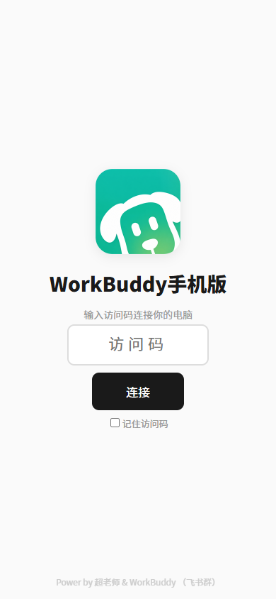
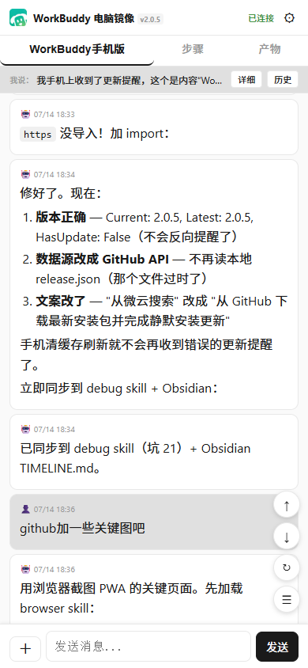

# WorkBuddy 手机版

> 用手机远程操控电脑上的 WorkBuddy AI 助手，随时随地查看任务进展、发送指令、预览产物。

<p align="center">
  
  
</p>

## ✨ 功能亮点

- 📱 **手机远程操控** — 手机浏览器打开即用，无需安装 APP
- 🔄 **实时同步** — 电脑端的任务、对话、产物实时同步到手机
- 🚀 **三层连接方案** — 局域网直连 / UPnP / Cloudflare Tunnel，自动降级，零配置
- 💬 **双向对话** — 手机发消息，AI 回复，跟电脑端体验一致
- 📎 **文件上传** — 手机拍照、选文件直接发给 AI
- 📋 **产物预览** — 代码、文档、图表在线预览
- 🔒 **安全认证** — 6 位访问码 + Token 双重认证
- 📊 **积分统计** — 今日消耗 + 累计使用一目了然
- 📝 **反馈通道** — 内置需求建议和问题反馈，自动收集系统信息
- ⚡ **数据缓存** — 任务列表和对话历史本地缓存，打开即看

## 🔗 连接方式

| 方式 | 场景 | 需要安装 | 速度 |
|------|------|---------|------|
| 局域网直连 | 同一 WiFi | 无 | ⚡ 最快 |
| UPnP 端口转发 | 家庭网络 | 无 | 🚀 快 |
| Cloudflare Tunnel | 公司网络 / 任何网络 | 自动下载 cloudflared | ✅ 稳定 |

Gateway 启动时自动检测可用方式，按优先级 A→B→C 降级。**用户无需手动配置，打开即用。**

### 手机连接流程

1. 电脑端 Gateway 启动后自动生成 6 位访问码
2. 手机浏览器打开 `wb.loveclaw.fun`
3. 输入访问码，勾选"记住访问码"
4. 自动连接到你的 Gateway

> 电脑重启后访问码不变，Cloudflare URL 自动更新，手机无需重新输入。

## 📦 安装

### 电脑端

1. 安装 [WorkBuddy 桌面版](https://www.codebuddy.cn/work/)
2. 下载 [WorkBuddy 手机版安装包](https://github.com/superkc2026/workbuddy-mobile/releases/latest)
3. 双击运行安装包，自动完成所有配置
4. 安装完成后，Gateway 自动启动并显示访问码

### 一键安装（推荐）

在 WorkBuddy 中安装 Skill 后，直接说"安装手机版"，Skill 会自动从 GitHub 下载最新版并静默安装。支持后续说"更新手机版"自动检查更新。

### 手机端

无需安装任何东西，用浏览器打开 `wb.loveclaw.fun`，输入访问码即可。

## 🏗️ 架构

```
手机浏览器
    ↓ (HTTPS)
Gateway (Node.js, :18787)
    ↓ (ACP 协议)
WorkBuddy 桌面端
    ↓ (API)
AI 模型 (GPT-4o, Claude, GLM 等)
```

### 三层连接方案

```
Gateway 启动
  ├── A 检测局域网 IP → 192.168.x.x:18787（同 WiFi 用户）
  ├── B 尝试 UPnP → 公网IP:18787（家庭网络用户）
  └── C 启动 Cloudflare Tunnel → xxx.trycloudflare.com（公司/其他网络用户）
```

每层独立运行，自动降级。用户电脑自己当服务器，不依赖任何中心节点。

## 🛠️ 技术栈

| 组件 | 技术 | 说明 |
|------|------|------|
| Gateway | Node.js 22 | 原生 HTTP 服务器，端口 18787 |
| 前端 | PWA | 单页应用，原生 JS + CSS，支持离线缓存 |
| 数据库 | node:sqlite | Node.js 内置 SQLite，无需外部依赖 |
| 连接方案 | 局域网 / UPnP / Cloudflare Tunnel | 三层自动降级 |
| 反馈收集 | 内置反馈系统 | 自动收集系统信息，存储在云端 |
| 访问码 | 6 位随机码 | 21 亿种组合，永久不变 |

## 📋 系统要求

| 项目 | 要求 |
|------|------|
| 操作系统 | Windows 10/11 |
| Node.js | 22+（安装包已内置） |
| WorkBuddy | 最新版 |
| 手机 | 任何有浏览器的设备 |
| 网络 | WiFi / 移动网络均可 |

## ❓ 常见问题

<details>
<summary><b>手机打不开 Gateway 地址？</b></summary>

- 确认电脑已开机且 WorkBuddy 正在运行
- 确认 Gateway 在运行（电脑端问 WorkBuddy "手机版地址"）
- 如果在公司网络，Cloudflare Tunnel 会自动启动，可能需要等 10-30 秒
</details>

<details>
<summary><b>手机看不到任务列表？</b></summary>

- 下拉刷新页面
- 确认电脑端 WorkBuddy 有任务在运行
- 清除浏览器缓存后重试
</details>

<details>
<summary><b>发消息后没收到回复？</b></summary>

- 确认电脑端 WorkBuddy 桌面版正在运行
- AI 处理可能需要几秒到几十秒
- 如果长时间没回复，可能是 serve 进程未启动，在电脑端重新打开 WorkBuddy
</details>

<details>
<summary><b>电脑重启后手机连不上了？</b></summary>

Cloudflare Tunnel 的地址每次重启都会变，但访问码不变。手机打开 `wb.loveclaw.fun` 输入访问码即可，无需做任何额外操作。如果 Gateway 配置了开机自启，重启后等 30 秒即可。
</details>

<details>
<summary><b>忘记访问码了？</b></summary>

在电脑端问 WorkBuddy "手机版访问码是什么"，会返回你的 6 位访问码。
</details>

## 🔄 更新日志

### v2.0.5 (2026-07-14)

**新功能：**
- 6 位访问码系统（替代 PIN，21 亿种组合）
- 访问码记住功能（localStorage，下次自动连接）
- PWA 数据缓存（任务列表 + 对话历史，打开即看）
- 今日积分展示（快照对比法）
- 飞书群二维码入口
- 反馈系统（需求建议 + 问题反馈）
- 全自动安装 Skill（GitHub API 查版本 → 下载 → 静默安装）

**优化：**
- 图片压缩（logo 51KB，QR 285KB）
- node:sqlite 替代 Python（消除外部依赖）
- 消息历史上限提升到 128MB
- 设置页 Tab 样式重构

**修复：**
- 手机看不到任务列表（Python 进程失败）
- ACP 超时后 serve 进程杀不掉
- 消息历史被 32MB 截断
- 今日积分计算错误
- 飞书群弹窗打不开

### v2.0.3 (2026-07-13)

- Relay 中继模式
- PWA 通过 Relay 访问
- 自建 DERP 中继
- Android APK 打包

## 📄 License

MIT

---

<div align="center">

**Power by 超老师 & WorkBuddy**

[下载安装包](https://github.com/superkc2026/workbuddy-mobile/releases/latest) · [反馈建议](https://github.com/superkc2026/workbuddy-mobile/issues)

</div>
